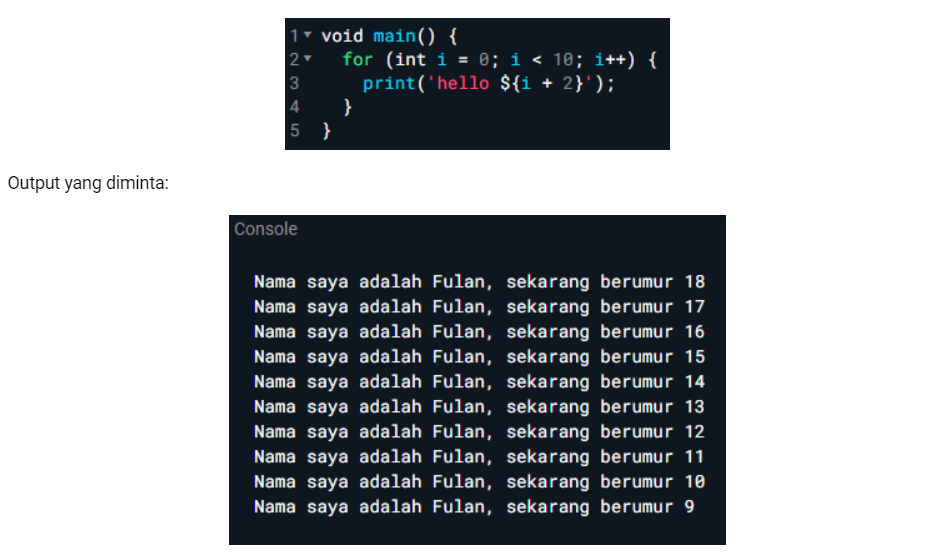
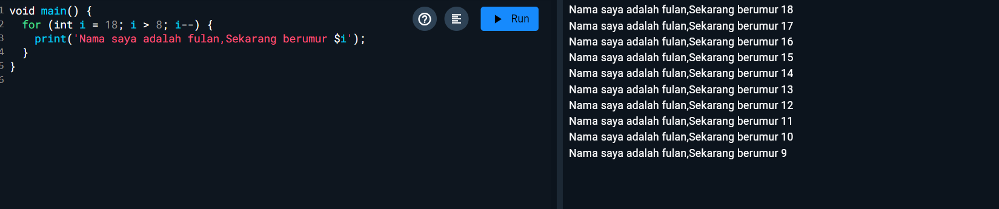

# **Laporan Praktikum**
# **Jobsheet 2 Pemrograman Mobile**

## **Data Mahasiswa**
>
Nama: Aunurrofiq Farhan Zuhdi

>
kelas: 3D

>
NIM:2241720198

>
Jurusan:Teknologi Informasi

>
Politeknik Negeri Malang

 

## **Soal 1**
Modifikasilah kode pada baris 3 di VS Code atau Editor Code favorit Anda berikut ini agar mendapatkan keluaran (output) sesuai yang diminta!

## **Soal 2**
Mengapa sangat penting untuk memahami bahasa pemrograman Dart sebelum kita menggunakan framework Flutter ? Jelaskan!

## **Soal 3**
Rangkumlah materi dari codelab ini menjadi poin-poin penting yang dapat Anda gunakan untuk membantu proses pengembangan aplikasi mobile menggunakan framework Flutter.

## **Jawaban soal 1**
1.

## **jawaban soal 2** 

2.Memahami bahasa pemrograman Dart sebelum menggunakan framework Flutter sangat penting karena beberapa alasan berikut:

Dasar Sintaksis: Dart adalah bahasa yang digunakan untuk menulis aplikasi Flutter. Memahami sintaksis dan struktur dasar Dart akan mempermudah pemahaman kode Flutter.

Pemrograman Berorientasi Objek: Dart adalah bahasa berorientasi objek. Memahami konsep seperti kelas, objek, dan pewarisan sangat penting dalam mengembangkan aplikasi Flutter yang terstruktur.

Asynchronous Programming: Dart mendukung pemrograman asynchronous dengan menggunakan Future dan Stream. Memahami cara kerja asynchronous ini sangat penting untuk menangani operasi yang memerlukan waktu, seperti pengambilan data dari API.

Library dan Package: Dart memiliki banyak library dan package yang dapat digunakan untuk mempercepat pengembangan. Memahami cara menggunakan dan mengimpor package ini akan meningkatkan efisiensi pengembangan.

Debugging dan Error Handling: Mengetahui cara kerja Dart dalam hal debugging dan penanganan kesalahan akan membantu dalam menyelesaikan masalah yang mungkin muncul saat pengembangan aplikasi.

## **Jawaban soal 3**
Berikut adalah poin-poin penting dari materi codelab yang dapat membantu dalam proses pengembangan aplikasi mobile menggunakan Flutter:

Instalasi dan Setup: Pastikan semua alat pengembangan seperti Flutter SDK dan editor (seperti VS Code atau Android Studio) terinstal dengan benar.
Struktur Proyek: Pahami struktur folder proyek Flutter, termasuk file pubspec.yaml, yang digunakan untuk mengelola dependensi.
Widget: Kenali berbagai jenis widget di Flutter, termasuk Stateless Widget dan Stateful Widget, serta cara menggunakannya untuk membangun antarmuka pengguna.
State Management: Pelajari berbagai pendekatan untuk pengelolaan state, seperti Provider, Riverpod, atau Bloc, untuk mengelola data dan perubahan status aplikasi.
Navigasi: Pahami cara menggunakan Navigator untuk berpindah antara berbagai layar dalam aplikasi.
API dan Data: Pelajari cara mengakses API dan mengelola data JSON menggunakan paket seperti http.
Desain Responsif: Pahami cara membuat antarmuka yang responsif dengan menggunakan widget seperti MediaQuery dan LayoutBuilder.
Testing: Kenali praktik pengujian di Flutter, termasuk unit test dan widget test, untuk memastikan aplikasi berjalan dengan baik.
Debugging: Manfaatkan alat debugging yang tersedia di Flutter untuk menemukan dan memperbaiki bug.
Deployment: Pahami proses build dan deployment untuk Android dan iOS, termasuk pengaturan untuk rilis aplikasi.

