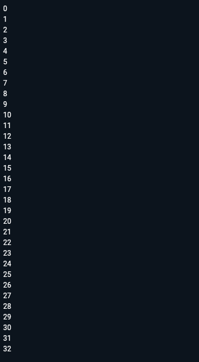
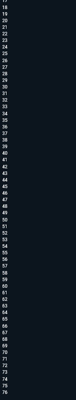
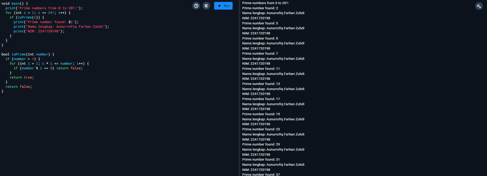

# **Laporan Praktikum**
# **Jobsheet 3 Pemrograman Mobile**

## **Data Mahasiswa**
><p>Nama: Aunurrofiq Farhan Zuhdi</p>
><p>kelas: 3D</p>
><p>NIM:2241720198</p>
><p>Jurusan:Teknologi Informasi</p>
><p>Politeknik Negeri Malang</p>
<br>

## **Soal 1**
Silakan selesaikan Praktikum 1 sampai 3, lalu dokumentasikan berupa screenshot hasil pekerjaan beserta penjelasannya!

### **Pratikum 1**

**Langkah 1**


```
void main() {
  String test = "test2";
if (test == "test1") {
   print("Test1");
} else if (test == "test2") {
   print("Test2");
} else {
   print("Something else");
}

if (test == "test2") print("Test2 again");
}
```


**Langkah 2**

pada pratikum 1 langkah ke 1 yang terjadi adalah

ketika kita menjalankan kode ini, kita akan melihat output "Test2" dan "Test2 again" di konsol. Hal ini karena kondisi else if dan kondisi if kedua terpenuhi, sehingga kode di dalam blok tersebut dieksekusi dan mencetak pesan ke konsol.

dan hasil nya adalah


**Langkah 3**
```String test = "true";
if (test) {
   print("Kebenaran");
}
```

Yang terjadi adalah 
jika kita ubah kode program menjadi seperti
```
void main() {
  String test = "test2";
  

  if (test == "test1") {
    print("Test1");
  } else if (test == "test2") {
    print("Test2");
  } else {
    print("Something else");
  }

 
  test = "true";

  
  if (test == "true") {
    print("Kebenaran");
  } else if (test == "test2") {
    print("test 2 again");
  }
}
```
maka hasilnya seperti berikut

image.png

### **Pratikum 2**

**Langkah 1**
```
void main() {
  int counter = 0;
 while (counter < 33) {
  print(counter);
  counter++;
}
}
```
terjadi eror karena belum di deklarasi dari variable counter

**Langkah 2**

hasilnya seperti berikut jika kode program diperbaiki

image.png

**Langkah 3**
```
do {
  print(counter);
  counter++;
} while (counter < 77);
```
terjadi eror kembali kareena belom di deklarasikan jika sudah di deklarasikan maka akan terjadi seperti ini

image.png


### **Pratikum 3**

**Langkah 1**
```
void main() {
  for (int index = 10; index < 27; index++) {
    print(index);
  }
}

```
terjadi eror karna belum ada deklarasi dan tidak ada nya post increment

**Langkah 2**

berikut hasil dari kode program jika sudah diperbaiki 

image.png

**Langkah 3**
```
void main() {
  for (int index = 0; index < 30; index++) {
    if (index == 21) {
      break;
    } else if (index > 1 && index < 7) {
      continue;
    }
    print(index);
  }
}

```
berikut kode program yang sudah diperbaiki dan berikut juga hasilnya

image.png

## **Soal 2**

Buatlah sebuah program yang dapat menampilkan bilangan prima dari angka 0 sampai 201 menggunakan Dart. Ketika bilangan prima ditemukan, maka tampilkan nama lengkap dan NIM Anda.

```
void main() {
  print("Prime numbers from 0 to 201:");
  for (int i = 2; i <= 201; i++) {
    if (isPrime(i)) {
      print("Prime number found: $i");
      print("Nama lengkap: Aunurrofiq Farhan Zuhdi");
      print("NIM: 2241720198");
    }
  }
}

bool isPrime(int number) {
  if (number > 1) {
    for (int i = 2; i * i <= number; i++) {
      if (number % i == 0) return false;
    }
    return true;
  }
  return false;
}
```

berikut juga hasilnya

image.png

yang dilakukan pada kode program tersebut adalah Menggunakan kondisi awal return number > 1 pada fungsi isPrime untuk mengecek apakah number lebih besar dari 1 lalu Menggunakan kondisi i <= sqrt(number) pada loop for dalam fungsi isPrime untuk mengoptimalkan proses pengecekan prime number.
Dengan perbaikan ini, kode program dapat berjalan lebih efisien dan mencetak output prime numbers dari 0 to 201 dengan benar.

